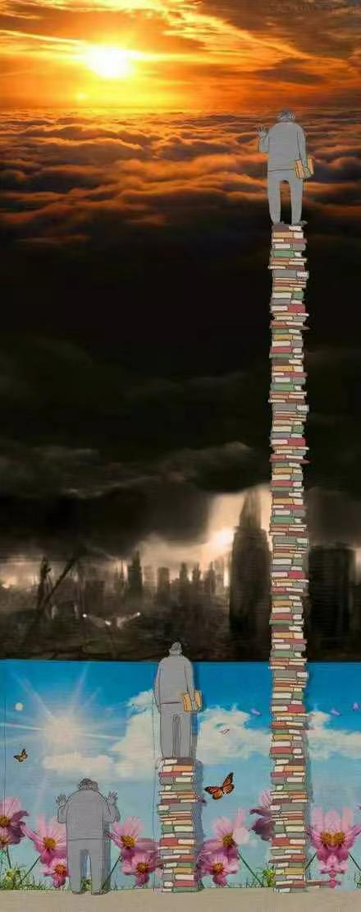

今天，刷推时看到一张图，感觉和我工作几年来的心路历程很像，特此分享下。

<!-- more -->

第一个人，脚下空无一物，眼中均是美好。

第二个人，读了一些书，看到美好背后的黑暗，开始陷入迷茫。

第三个人，学识渊博，了解运行规律，明白世界不是非黑即白，故此看到曙光。

而我呢，目前可能还处在第二阶段，但也清楚应该继续向前，走向第三阶段。

# 第一阶段

> 无知小粉红心态

读书期间，我没有好好读书，只能说是在规定的时间节点作出对应的反馈。

毕业后，朋友进了体制内，而我去了一家小厂当码农。小厂也挺好，朝九晚六，不追求结婚买房，过得很快乐。

然而，反倒是在毕业后的那个6月，我拿起了一本放在家里很久很久的书，余华的**活着**。好像是打开了某些任督二脉，感觉原来我不是不爱读书，我只是不爱上学而已。

那年以后我最少每年读一本书，当然了一本书算得了什么。但是对我我来说，读书是需要时间去消化的。我当时读完《活着》的时候，内心久久不能平静。就好像我也在那个年代，眼睁睁的看着书里的所有事的发展，而无能为力。三个月过后，我才决定看下一本书。

反正这几年读了二十余本吧，但是还是会时常觉得自己**脑袋空空**，时常表达不出我内心真正想表达的东西。

有一次，社保税改要求公司按员工真实收入去上报缴纳基数，也就是说社保缴纳金额变多、到手工资变少。看到群里都在吐槽，而那时的我却在群里发表了「高见」：

> 社保不也是自己的钱么，提高缴纳基数更赚么？gj 这是为我们个人谋福利！

结果招来一顿全嘲，说我「啥也不懂」。后面又工作了一段时间，我才彻底明白了他们的槽点。

  

# 第二阶段

> 生活压力，终使自己变成自己最讨厌的人

早期很喜欢逛知乎，也关注了一些前端大佬，希望学点技术。

但从某段时间开始，发现这些人很喜欢「键政」，大谈国事。

大多都是负面情绪，我不喜欢。

  

随着年龄上去，迫使自己需要关注技术之外的内容：房产、理财、交际，往大点说，是政治、历史、和经济。

  

粗浅了解之后，我开始悲观：

-   刑不上大夫
-   十年寒窗凭什么拼得过人家三代人的努力
-   历史就是圈，教员想改变的事情是无法改变的
-   zg人的劣根性
-   tz内的劣根性

于是，我也开始键政，变成了那个曾经最讨厌的人。

  

# 第三阶段

> 探索底层逻辑

工作压力加上生活压力，使我一度抑郁，精神内耗。

好在，我每每内耗严重的时候，会出去摄影拍照，或者看书思考，或者打打游戏。

现在，我也分享下我的一些想法，虽然还未正式踏入第三阶段，但也大概摆脱了第二阶段的影响。

1.  接纳自己的平凡
2.  最重要的能力，是获得能力的能力
3.  遵从历史规律，做务实求进的人
4.  思考底层逻辑，所有**方法论**都可以通过**底层逻辑（相同之处）＋** **环境变量** **（不同之处）** 来解释
5.  提升思维认知，多学习技术之外的内容

# 最后

以上便是我工作五年的心路历程，从开始的无知，最后开始寻求转变。

本文纯碎碎念~
