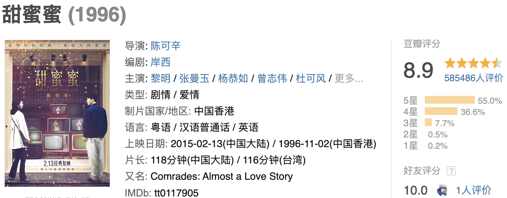

::: v-pre

摘抄🌟

1.你来香港的目的不是我，我来香港的目的也不是你。

观影是一个惬意的周六，下午在家里她说："我们看甜蜜蜜吧"，我说：“好啊”。这不是她第一次说要看这个电影，因为这是她最喜欢的爱情片，对此我也抱有很大的期待。好长时间没有看过一部好的电影了，看完后我有种想要写点东西的冲动。我知道在这种情况下写一些东西是最直白的、清晰的，也是情感最真切、浓烈的时候。
导演没有把生活中的苦难特意强调，一笔带过地苦楚反倒让这个电影更加真实。两个人来香港的目的都不是为了彼此，却因为彼此的陪伴在这个城市有了不苦的生活，可能这也是他们会以“挚友”相称的原因吧。好的爱情，总是百转千回。不仅仅是我爱你你爱我，也不仅仅是两情相悦，也不单是相遇的甜，相爱的蜜。好的爱情能够包罗万象，兜兜转转地最终转过头，看到的还是彼此。那些纵横交错的可能是时光，可能是生离死别，也可能是异乡，或是不同的时代背景下巨大的茫然，亦或是生活中的挣扎。我一直都相信着：缘来则聚，缘尽则散。我们可能会在生活中，想拼命的抓紧些什么，可是还是失去了。电影里的他们，只有彼此的时候他们也是牢牢抓紧彼此的，可是在那些不属于彼此的时刻，都有自己的不得已。黎小军有“理想”，有“亲爱的小婷”。李翘有给她纹米奇的豹哥。所以在面对着黎小军的坦白，小婷明白一切不可重来时，唯有以不可实现的假设安慰自己，“如果你没有来香港，如果你留在天津，如果我在你身边”。还有在那个雨夜，李翘扑在豹哥怀里哭得那么肆意的时候。那份温暖不是来自路灯下痴等的黎小军，而是身边这个男人的宠爱与包容。他说着：“在台湾有很多老婆”，“人人都比豹哥好”，但李翘明白米老鼠的一颗真心。我也有过不解，为什么可以心里有一个人的情况下爱上另一个人？可能他们也都努力过想好好爱除了彼此以外的人吧，但是做不到。看完这个电影，我犹豫了。我也不确定我之前坚信不疑的东西，是不是还会坚信不疑。世上的感情无关对错，这我比谁都明白。即使所有人都反对，爱就是爱了，更何况是彼此相爱。我也想活在电影里，至少结局是好的，就算过程曲折点，也是无关痛痒。
缘起，在1986年的火车上，熟睡着靠着彼此，来到香港。缘续，1990年，误触了的汽车喇叭声让黎小军鼓足勇气，在车窗外的深吻又把他们的爱情唤醒。缘定，1995年，在放着邓丽君去世这条新闻的电视玻璃前重逢。整部电影，美好的结局，但是看完，我却如鲠在喉。明明结局是好的，可是我也没觉得很开心。因为大多数人，是一定会分开的。那怕放不下也会不打扰，最后甚至会忘了对方的样子，会意难平。分离是常态，重逢适合梦。

:::