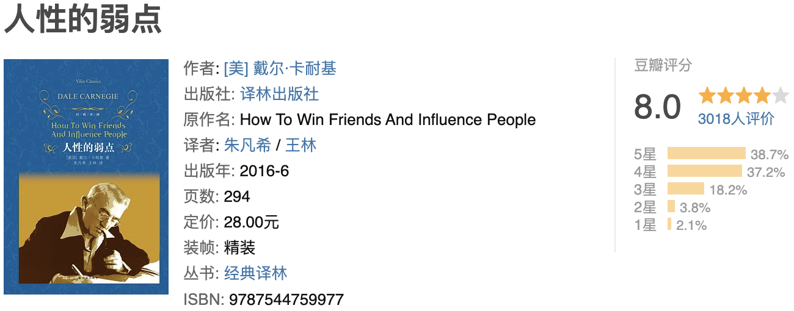

这本书更多讲述的是工作或与人相处的生活方式。也许这种生活方式有它自适应的环境和文化。但在信息爆炸和互联网深度普及的时代，虽称不上一个万能钥匙，也不失为一种学习参考的例子。

与人相处：不要去批评别人，要善于称赞对方，更要能激发对方的渴望。人们对一个现象的看法，最原始的肯定是来自他本人。而这种自以为是往往早就根深于他独有的成长环境，接受的教育以及经历过的人事。所以只要面对的不是物理公理，想法差异就在所难免。我们可以保留自己的意见，但同时也要尊重对方的看法。试图用批评让别人改变自有想法，只能让对方觉得不受尊重，即使口服心里也未必好受。自尊是人和动物的一项重要区别，能够让别人去做事，除了权利物质责任以外，赞美也是一个比较好的办法。适当诚恳的称赞并不是虚假的恭维，是不同角度对同一人和事的的不同理解。三人行必有我师，谁也没法保证自己是最聪明的。如果我们能真诚的与人相处，必定会发现他身上的优点。诚于嘉许，宽于称道，总会有听者有意的时候。而激发别人的渴望则是结果导向，以假使做成了，你能怎么样来引起兴趣。当然这里需要兼顾自己与对方的不同立场，要能事先捕捉到对方观点。

让别人喜欢上自己：真诚也许不是最重要的，但却是最基础的。大多数人对于自己以外的事情并不关心。如果我们能够真诚的去关切别人的需求，提供帮助建议或者表示同情，才会让他从从不关心你的事情到瞅你两眼。当然给别人留下一个好的印象同样重要。好的印象来自于衣着长相，但也来自气质，保持微笑是第一步。如果希望别人看见自己时是愉快的，首先我们看到别人也一定要心情不错。正如销售，推销产品的第一步是推销自己。记住别人的名字是个很有用的技巧。这不仅是礼貌也是增进对方亲切感的神秘武器，当然反之，叫错别人名字是件很尴尬的事情，最好是在第一次见面就记住对方的名字。学会倾听是交谈中的一种智慧。因为与你谈话的人他对自己的需求和问题比对你自己的要兴趣100倍。要想获得共同利益的第一步就是了解对方的需求。就算你是个大人物，从你口中说出的道理不见得比别人口中说出的更有道理。多谈论别人感兴趣的话题，使别人感觉他自己很重要，者固然也就要求我们需要提前多做了解或者多些自我的阅历，只要这样，才能随时随地的驾驭住不通场合的人和事。

让对方认可自己：避免与人争辩，辩论也许很快能够分出胜负，但试图通过辩论改变别人的想法通常只能让对方更加坚定他自己的看法。当一个人的自重感被摧毁或严重打击时，反抗情绪就在所难免，即使不表现出来。正如林肯所说：凡决意成功的人，不能费时于个人的成见，更不能费时去承受结果，它会搞坏自己的脾气，使你丧失自制力。也不要直接指责别人，特别是不恰当的指责。我们要比别人聪明但不要表现出来。如果想证明什么，别让人知道，要不露痕迹。我们要给别人承认自己错误的机会。人们往往会在充满宽容谅解热情的氛围下改变自己的想法。但如果直接指出对方的问题所在，通常会使人更加固执，这时候他维护的不是一个想法，而是自尊。苏格拉底说我知道的只有一件事情，那就是我什么都不知道，大智慧啊！当然当我们错了时，也不要试图先解释，要在别人指责自己前找个机会先把自己的错误说出来。而对于那些对我们有成见的人，我们越要心平气和友善的去沟通。不用直截了当的说不，让对方把话都说出来。适当时候做个傻子，启发别人得出结论，让对方觉得这是他的想法，效果会更好，俗话说被骗的往往是聪明人嘛。正如政治上，聪明的宠臣，总会让平庸的君主觉得自己比臣下聪明，无数的历史也证实，功高盖主并不是什么好事。换位思考也是个重要的事情。正如前文所说，人们思想和行为不是一朝一夕的事情。倘若我们能探寻出隐藏在想法背后的真实情况，就必须把自己放在对方的位置上去理解他，同情他，不管你自己是不是更需要同情，尝试说：如果我是你，我也会和你一样。

但在自己的观点也需要澄清时，可以做些包装以戏剧性的表达代替平铺直述，或者绕一弯子，先称赞和感激，再以陈述的方式指出问题。让批评不被怨恨，显得我只是顺带提下这个问题的样子，旁敲侧击加上适当赞美，然后再说出问题，可以尝试用“而且”代替“但是”。任何事情的失误都不可能是一个人或单方面的过错，真要批评可以先谦卑的承认自己也不是十全十美。而且用建议的方式代替命令的口吻会让别人好接受很多。做人留一线日后好相见，当别人犯错时不要把话说死，可以多称赞别人细微的进步，也可以给别人带个高帽子，也许就因为在乎这顶帽子，他会照着帽子的方向去努力。

至于书中还提到创造奇迹的信件，我的理解是在需要别人帮忙做事时，可以都站在对方角度上想想他帮我，需要做哪些，然后可以试着在他需要做的事里，提前“为他”做些力所能及的事情，以表诚意，让对方有种重要任务的感觉。举个例子，你要别人回信，可以先把信封准备好，写好回寄地址和贴好邮票等。当然了，一定要记住帮你是情分，不帮才是本分。

总结起来，觉得这本书还是值得大家一读，并且部分章节可以反复加以温习。虽说作者是立足于西方思维环境，可能有些方式不大适合东方文化，但我相信道理是相通的。在我们最习以为常和自我的行为方式中寻找另一种与人相处待人接物的行事作风，综合实际情况具体场合，真诚而又有技巧的让别人愿意并乐于接受自我。毕竟我们作为一个群居物种，更多时候需要来自外部的肯定和合作。

----

摘抄🌟

一.从现在开始，请你记住待人处世的第一大原则：不要批评、责怪或抱怨他人（先从不批评，责备，侮辱开始，这个学会了，才能从心底里赞美别人）
1.真诚地赞赏他人 （鼓励和赞扬的魔力）
如果你想学会待人处世，那就请记住：真诚地赞赏他人。---卡耐基
2.天底下只有一种方法可以影响他人，就是提出他们的需要，并且让他们知道怎样去获得。 ---卡耐基
哈利• 欧佛瑞在《影响人类行为》一书中写道：“行为乃发自我们的基本欲望……无论在商场、家庭、学校或政治上。对那些自认为‘说客’的人，有句话可以算是最好的建议：要首先引起别人的渴望。凡是能这么做的人，他就能左右逢源，永不寂寞。”
3. 我们在生活中都是顾及自己的面子的，别人又何尝没有自尊心呢？伤害他人的自尊就像给树木剥皮一样具有毁灭力。 ----卡耐基
富兰克林说：保留他人的面子和自尊，是人际交往的底线。
4.人有两种能力是千金难求的无价之宝——一是思考能力，二是分清事情的轻重缓急，并妥当处理的能力。（很多人很忙却没有成就）
5. “现在就去做”可以影响你生活的每一部分，它可以帮助你去做该做而不喜欢做的事：在遭遇令人厌烦的职责时，它可以教你不推脱迟延：当然，它更能让你及时抓住机会。
6.永远不要对敌人心存报复，那样对自己的伤害将大于对别人的伤害。
人性本善。我行我素，恶语伤人是我们不提倡的，当你同样遭受如此对待时，你又会如何呢?
7. 即使我们没办法爱我们的敌人，起码也应该多爱自己一点。我们不应该让敌人控制我们的心情、健康和容貌。
8.心理学中有一条规律：我们对别人所表现出来的态度和行为，往往会做出同样方式的反应和回答。
在与人打交道时，我们发现我们自己的待人态度会在别人对我们的态度中反射回来。如同你站在一面镜子前，你笑时，镜子里的人也笑；你皱眉，镜子里的人也皱眉；你叫喊，镜子里的人也对你叫喊。
9.只要我们互相容忍谦让，我们的人生道路不就变得更加明亮、平坦、宽阔了吗?
1754年，身为上校的华盛顿率领部下驻防亚历山大市。当时正值弗吉尼亚州议会选举议员，一位名叫威廉•佩恩的人反对华盛顿所支持的候选人。
在小酒店里，华盛顿与佩恩就选举问题激烈争论，华盛顿说了一些冒犯佩恩的话。佩恩火冒三丈，一拳将华盛顿打倒在地。当华盛顿的部下跑过来要教训佩恩时，华盛顿急忙阻止了他们，并劝说他们返回营地。
第二天一早，华盛顿托人给佩恩一张便条，约他到另一家酒馆会面。佩恩料想会有一场决斗，做好准备后他赶到酒馆，令他惊讶的事情发生了。
华盛顿站起身来，伸手迎接他。华盛顿说：
“佩恩先生，我为昨天我说的话向你道歉，我不可以那样说，不过你已经采取行动挽回了面子。如果你认为到此可以解决的话，请握住我的手，让我们交个朋友。”
从那以后，佩恩成为华盛顿的狂热崇拜者。
 	华盛顿完全可以采用另一种方式来对付他的敌人，可是，还有哪种方法比化敌为友更为高明呢？
《圣经》里说：“要爱你的敌人。”这是多么智慧的话语啊！如果心存爱心，一切事物都是美好的。
10.自夸、自私、贪婪、讽刺、仇恨、嫉妒、自怜、邪念、自我意识强烈，这些性格就好像是寄生在人们身上的水蛭，会带给他们痛苦，使他们生病、甚至夺走他们的生命。
去爱一个可爱的人并非难事，难的是去爱不可爱的人。要求自己去体谅一个自大、傲慢、尖酸、刻薄、自私、自傲或粗鲁的人，这确实是一项很大的考验。
了解这些人确实很困难，因为这还需要你费心去了解这些人受了伤害，某人使他们觉得不受重视而且不被需要。不过，不要让那些原因而造成你漠视和偏见，进而使别人永远痛苦。因此，与其恨我们的敌人，让我们还是怜悯他们，并感谢上天没有让我们跟他们一样经历同样的人生。与其诅咒报复我们的敌人，何不给他们谅解、同情、援助、宽容以及为他们祈祷呢？
11.人生有两项主要目标：第一，拥有你所向往的；第二，享受它们。只有具有智慧的人才能做到第二点。想想自己拥有的恩惠，你就不会再有忧虑了。
12.一位刚毕业的大学生，进入一家机关工作，他才华横溢锋芒毕露，受到众人的艳羡后更是不可一世，上司的心理天平却渐渐失去了平衡，从器重到猜忌，再到冷眼相待。大学生于是被高高挂起，失去了许多施展才华的机会。
他苦闷至极。忍无可忍同上司大闹一番，回家向父亲摊牌，自己决心已定，准备一走了之．老爸弄清原委后付之一笑．委婉而郑重地向儿子建议--亲爱的儿子呀，像对待我一样，去对待你的上司；像感激我的养育之恩一样，去真诚地感激他的每次赏识和赞美，并且，因为这份感恩之心，谅解他的冷遇和责难，其实，那都是你生命里的考验。
儿子惊呆了，一番思索后．却不动声色地接受了父亲的建议。
一周之后，上下级之间的关系明显改善了；一个月之后。他们开始微笑着相互问候。一年之后有升迁机会的时候，上司毫不犹豫地推荐了这位曾被自己视为“眼中钉”的大学生。
二.第二篇：使你平安快乐的故事 •不要让批评之箭中伤你
1. 一般人常因他人的批评而愤怒，有智慧的人却想办法从中学习。敌人对我们的看法比我们自己的观点可能更接近事实。
    利用别人的批评迫使自己进步。是对待批评的最有价值的做法。无论批评者是什么动机．我们总可以把批评当作改进自己的一种指南。甚至，敌人的批评比朋友的批评还可贵些。
2. 只有你真正关心他人，才能赢得他人的注意、帮助和合作，甚至最忙碌的重要人物也不例外。对别人好不是一种责任，它是一种享受，因为它能增进你的健康和快乐。你对别人好的时候，也就是对自己最好的时候。
3.能设身处地为他人着想，了解他人心里想些什么的人，永远不用担心未来。
4. 只要你能微笑，你就永远不会贫穷。微笑是最好的化妆品。行为胜于言论，对人微笑就是向他人表示：“我喜欢你，你使我快乐，我喜欢见你。”快乐不在乎外界的情况，而是依靠内心的情况。
    记住：微笑能带来财富，微笑是你的最大优点。
5.做一个善于倾听的人
“说”属于知识能力范畴，而“听”才是聪明才智特有的。倾听是使信任充分发挥其作用的润滑剂。始终挑剔的人，甚至最激烈的批评者，常会在一个有忍耐和同情心的倾听者面前软化降服。所以，如果你希望成为一个善于谈话的人，那就先做一个注意倾听的人。
    俗话说得好：“会说的不如会听的。”
6.那些讨厌的人就是为自私心及自重感麻醉的人，那些只谈论自己，只为自己设想的人。
与人沟通的诀窍就是：谈论他人最为愉悦的事情。
每个人都有各自不同的兴趣与爱好，一旦你能找到其兴趣所在，并以此为突破口，那你的话就不愁说不到他的心坎上。
7. 了解他人，主要是了解对方的价值取向和兴趣点，就是了解对方对什么事情最关心、最有兴趣，必须把对方认为重要的事情摆在如同他对你一样重要的位置。
有一对青年男女恋爱，姑娘的父亲是高干，小伙子不仅人精明能干，长得亦潇洒，但家在农村，故而，当姑娘对父亲提起这个小伙子时，其父以为门不当，户不对，便断然拒绝：姑娘一气之下要和家庭决裂，但这个小伙子却不让姑娘任性使气，并说他有办法改变姑娘父亲的执拗。他问姑娘她父亲有何爱好，当知姑娘的父亲爱下棋、喝酒后，便让姑娘先对她父亲说另谈了一个对象，其他一切都不要提起。以后同姑娘去她家时，小伙子一去便提一两瓶好酒，特别是提酒便顺便捎一对精致的小酒杯。小伙子为了那些酒杯，可是跑了许多工艺商店，今天两只高脚杯，明日一对有机玻璃三脚爵。弄得姑娘的父亲喜爱上了这个年青人。小伙子每次见姑娘的父亲，必定与之谈论围棋。为了弄通围棋，小伙子买了许多有关围棋的书报杂志。姑娘的父亲喜爱围棋纯属业余爱好，并未作过精心研究，而小伙子本对围棋不在行，为了打通姑娘的父亲这一关，自然下工夫不小，倒也很在行。故而谈起围棋倒也俨然内行。加上小伙子精明机智，不到几个月，姑娘的父亲觉得这个小伙子很对胃口，于是答应把女儿嫁给他。
8.如果你想赢得人心，首先要让他相信你是最真诚的朋友。
9.学会控制情绪是我们成功和快乐的要诀。在愤怒之前，先坐下来冷静下来。
10.当你想使人信服时，请不要忘记：以友善的方式开始。
三.与人沟通
1.卡耐基认识到，如果你想让他人接受你的思想方式，重要的一条秘诀就是：
 “给他人说话的机会，让他人觉得这个想法是他自己的。”
别将自己的意见强加于人
2.从别人的立场看待他的世界
对方为什么会有那样的思想和行为，其中自有一定的原因。探寻出其中隐藏的原因来，你便得到了了解他人行动或人格的钥匙。
在家庭与社会生活中，存在着很多的不协调，这是很正常的。因为我们每个人都用自己的耳朵去听，用自己的眼睛去看，经由不同的头脑去理解事情。你所做的决定，就是经过你自己的大脑思考的独特的后果。
但是，我们应该尝试从别人的立场看他人的世界--而不是以我们自己的眼光来看他人世界。要做到这一点，有一个方法：找出别人的优点，不管他们的生活方式以及信仰与我们有多么显著的不同。在发掘别人优点的同时，你是在用爱心和他人交流。我们最需要的就是爱，这也是沟通的前提。
3.爱出风头是不好的
洛克菲勒极不喜欢摄影记者拍摄他子女的照片，便对记者们这么说：“你们也是有孩子的人，一定了解我的感受。你们一定也知道，太出风头对小孩子是很不好的。”洛克菲勒巧妙地激发了人人都不愿伤害儿童的高尚动机，得到了他人的赞同。
4. 赞美也是建立信赖感的方法之一，但是记住赞美千万要真诚，而且发自内心，不能说虚伪的话，只要发现他有什么优点，就真诚地告诉他。
5. 如果你不同意他人的意见，你或许想阻止他，但最好不要这样，这样做没有什么效果。
6. 拿破仑在长时期的军旅生涯中养成体谅他人的美德。作为全军统帅，批评士兵的事经常发生，但每次他都不是盛气凌人地责怪他人，而能很好地照顾士兵的情绪。士兵往往对他的批评欣然接受，而且充满了对他的热爱与感激之情，这大大增强了他的军队的战斗力和凝聚力，成为欧洲大陆一支劲旅。
    在征服意大利的一次战斗中，士兵们都很辛苦，拿破仑夜间巡岗查哨。在巡岗过程中，他发现一名巡岗士兵倚着大树睡着了。他没有喊醒士兵，而是拿起枪替他站起了岗，大约过了半个小时，哨兵从沉睡中醒来，他认出了自己的最高统帅，十分惶恐。
    拿破仑却不恼怒，和蔼地对他说：
    “朋友，这是你的枪，你们艰苦作战，又走了那么长的路，你打瞌睡是可以谅解的，但是目前，一时的疏忽就可能断送全军。我正好不困，就替你站了一会儿，下次你一定小心。”
7.保留他人的面子！这是何等重要的问题！而我们却很少会考虑到这个问题。
8.一个好妻子（神的妻子，怪怪怪的妻子，很多日本女人都这样，这可能就是我们喜欢女人的原因吧：鼓励和温情）
可以毫不夸张地说，对于男人来讲，鼓励与温情就像燃料对于引擎那么重要，它能给他的心理和精神充电供能，将失败转化为成功。而对于女人来讲，赞美和鼓励同样重要。
9.不受欢迎，在于老谈自己，不关心别人
    比尔之所以不受欢迎，在他自己看来乃是一个迷，他具有很大的才能，又是个勤勉努力的人。他在每天工作完毕以后，也喜欢混在同伴中寻快乐。但他往往只顾到自己的乐趣，而常常给人以难堪，所以很多人一看到他，就避而远之。
    但比尔绝未想到，他不受欢迎最关键的原因乃在于他的自我封闭心理，自我封闭乃是他不能赢得人心的主要障碍。他只想到自己而不顾及他人。他竟然一刻也不能把自己的事情搁起，来谈谈他人的事情。每当与别人谈话，他总是要把谈话的中心，集中在自身或自己的业务上。
    一个人如果只顾自己，只为自己打算，不与别人交流，那么就没有吸引他人的磁力，就会使别人对他感到厌恶，就没有一个人喜欢与他结交往来。
三.快乐的工作
1.如果你已经到了18岁，那么你可能要做出你一生中最重要的两个决定——这两个决定将深深改变你的一生，影响你的幸福、收入和健康——第一，你将如何谋生；第二，你将选择一个什么样的人生伴侣。
2. 工作上得不到快乐，在别的地方也不可能得到。因为你一天的大部分清醒时间都花在工作上了。一个人只要无限热爱自己的工作，他就可能获得成功。
3. 罗素说：“我的人生正是：使事业成为喜悦，使喜悦成为事业 。”

