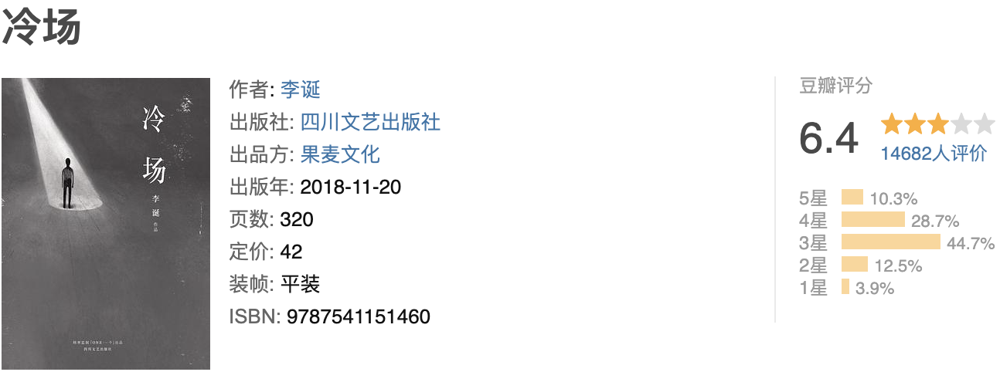

看了笑场，看了十几页扯筋实在是看不下去了，可能因为我的心比较浮躁吧。然后看冷场，文字比较沉，我喜欢这种稳重。说稳重也许太过了，应该说是我喜欢这种用简单的文字表达出的某些道理。读着读着，能感受到李诞的丧，还有对人生的不期待。也有反映社会现状，也许是大多数人心中那种丧的无奈吧。看到有些故事对我而言想读下去的欲望都没有，我没耐心读完，也是没必要读完。道理都懂，还是过不好这一生。

----

摘抄🌟

- 喉结动让喝酒更有仪式感。女人咽酒的仪式感是咽下去之后保持安静。
- 人生快乐小指南：不要去推敲习惯。
- 我们不是结了婚悲观，是都有了悲观的认识才敢结婚。