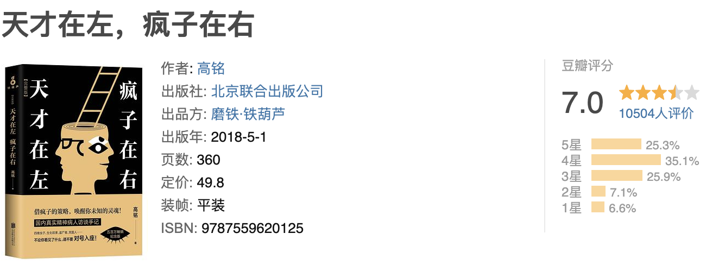

第一次听这本书忘记是在哪个时候，第一次打算读这本书是基于陈乔恩在某综艺中推荐的，第一次读这本书是在墨尔本飞阿德莱德的飞机上。原本只是想打发一个半小时的飞行时间，没想到这本书把我深深的吸进去了。读到里面的一些故事的时候，我真的觉得我认知、“任督二脉”这些，通通被打开一样。也让我对精神病人有了新的定义和理解，其实他们和天才就是一步之遥的。在逻辑上，思想上，他们比普通人更为敏感，有些人对于一些比较冷门的领域很有研究，那么“天才”和“疯子”其实也是无法区分的，我们只是拿不同的标准去衡量罢了。当然也不乏有一些被害妄想症，社交恐惧症，强迫症的病人。有些病人可以跟你讲的头头是道，但是他们有些人的逻辑是有问题的。说半天要么是过于唯心，过于自我恐惧，没有唯物主义的观点。要么就是那种对于一个领域钻研且在其中的某个问题没有确切的答案，自己想着想着就走不出来了。这本书里讲了很多故事都没法用科学去解释，所以我也不会去真的评判它的对错与否。所以，在我看来：不要轻易被别人的话语带着走，不要迷失自己，要有自己的思想，遇事也请深入思考。
以上

----

摘抄🌟

- 有些现象，如果用已知的各种学科、各种知识都不能解释的话，那么对于剩下的那些解释，不要看表面是否很荒谬或者离奇，都要学会去尊重。因为那很可能就是真正的答案。但是求证过程一定要谨慎自习，不可以天马行空。
- 知识永远不会是负担，欲望才是负担。你要看本质，有了知识，你自己又附加了很多欲望出来，也就是说，你获取知识的原始动力不是纯粹的。
- 人间一世五十年，我不愿为了完成活着而活，我愿为了梦想而活。
- 精神，依托于物质而存在于物质世界，但事实并不同于物质，也不属于物质世界。精神，就是那块大块果冻里的微小的气泡。