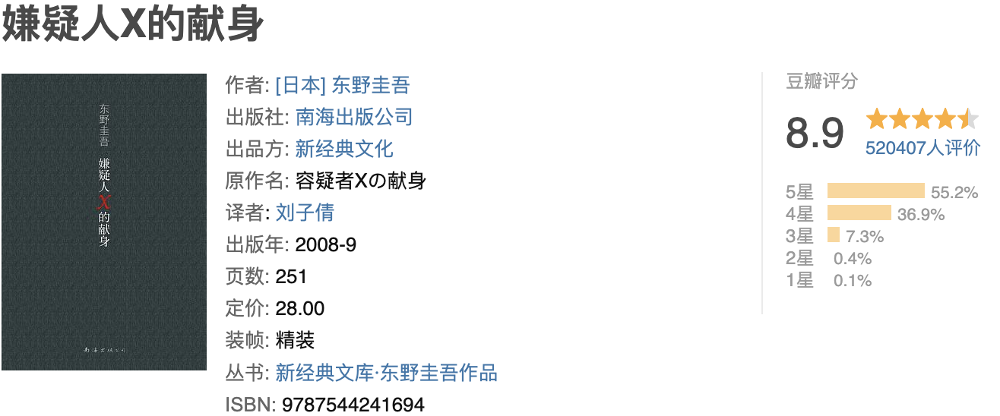

《嫌疑犯X的献身》是我最早接触的东野先生的书，也是因为这本书，我才爱上了东野圭吾的日式推理（至今还记得我上瘾似的读这本书下午翻开晚上睡觉之前看完）。这是我读过最浪漫动人的推理故事，也是最严谨理性的爱情小说。是的，将推理小说写成如此深刻的爱情故事，除了东野也没谁了。

（一）恋爱中的数学家
数学家也许是最贴心的恋人，浪漫起来让人完全招架不住，不然诺贝尔老爷爷不会败下阵来，而诺奖里也没有了数学奖。言归正传，故事里的石神同样也是一个陷进爱情里的数学家，他暗恋着邻居靖子，每天会到她工作的便当店里买便当，只是为了看她一眼。不可否认，石神是个百年一遇的天才，他心思缜密、沉着机智，但在爱情里他甘愿做一个傻子（的确，生命中能遇到几个温暖如光的人儿，对于石神而言，靖子就是照进他生命里的阳光）。

石神的爱情就是他的信仰，他的爱里没有占有，没有嫉妒，纯粹得令人心惊。开始的时候，他收敛着他的深情，掌握着太好的分寸，只在不远不近处默默守护；而一个意外的出现把平静的水面打破了，他不得不从暗处出来，为爱人遮风挡雨，承担一切。他的爱带着偏执，带着成人之美的动容，带着不顾一切的决然，也带着一厢情愿的无奈，向我们全面阐释了什么是“我爱你，可与你无关”，只是到了最后，他的守护既不救不了靖子，也救不了对自己。

（二）天才的对决
这本书的除了令人动容的爱情，最大的看点当然要属令人烧脑的推理盛宴。书中汤川学与石神两大天才之间对决，读起来有种英雄惜英雄的悲壮。两人都是帝都大学的高材生，都是智商碾压众人，情商令人着急的类型，只不过一个自闭冷淡，喜怒永远都是不露声色，一个自我中心，沉浸在个人世界里自说自话；一个精密布局、设计巧妙，一个抽丝剥茧、寻根究底，两个自带神经质的天才，就像矛和盾，见招拆招间竟然有种相生相克的宿命味道。只不过，汤川对胜负的重视远远超过了对同类的惺惺相惜，他用他的自以为是，毫不留情地捏碎了石神的信仰，毁灭了他。

（三）绝望的正义
鲁迅先生说过，悲剧是将人生有价值的东西毁灭给人看。《X》无疑是一部众人皆输的悲剧，里面充满着东野圭吾对现实世界的诸多嘲讽和失望。现实里多的是逃脱罪责的作恶之人，逍遥自在，而真正被法制规则限制的不过是善良正直的人们。书中的靖子是真正的恶吗？她独自带着女儿，靠着自己能力养活自己和女儿，以笑脸和阳光对待生活的诸多苦难，以求平静度日，就连错手杀人也不过是忍无可忍的一时反抗；也许，石神的恶是真正的恶，但他一样是社会悲剧下的牺牲者。在各种机缘巧合下他不得其志，灰暗的人生里只剩下靖子母女这一缕阳光，为了守护靖子母女，他选择漠视他人和自己的生命，自愿成为这场因果报应中的噬罪者。至于汤川伸张的，的确是正义，只是这份正义来得令人绝望、心痛（如果披着善良外衣的犯罪一样是犯罪，需要被绳之以法，那为非作歹的犯罪就不是犯罪了，不需要追责吗）。

至今难以忘记结尾处，石神那如呕出灵魂一般的嘶吼，仿佛穿透那漫漫长夜直击心灵。

----

摘抄🌟

1、俘虏对方，并非是杀死对方，而是降服对方，因此才能够再次利用。

2、有些真相注定是要小心翼翼深埋心底的，因为答案揭晓的那一刻，也是灰飞烟灭的开始。

3、石神这个人很单纯。他寻求的解答，向来很简单。他绝不会同时追求好几样东西，而他用来达成目的的手段也很简单。所以他从不迟疑，也不会为一点小事而轻易动摇。不过，这也等于表示他不擅长生存之道。不是赢得全部就是满盘皆输，他的人生随时伴随着这种危险。 ----东野圭吾

4、对于崇高的东西，能够沾到边已足够幸福。

5、好的定理必然有美妙自然又简单的证明。

6、对于为何要学习某种东西抱有疑问，是理所当然的。唯有当这个疑问解除了，才会产生求学的目的，也才能通往理解数学本质之路。 

7、汤川对石神说：“很可惜，那么优秀的头脑不得不用来做这样的事。”
石神说：“对我说这样的话，也只有汤川你了。”

8、他压根没有想和她们发生关联的欲望，他认为她们是自己不该碰触的对象。同时他也发觉数学也是如此，对于崇高的东西，光是能占到边就够幸福了。妄想博得名声，只会有损尊严。 

9、汤川对花冈靖子说：
“他做出了你所不知的牺牲。也许天才的世界最寂寞的，不被世人所理解
只有学术能作为寄托，总是在自己的世界里感受孤独，
被别人称为异类，被自己的学生无视。

10、这世上没有无用的齿轮，只有齿轮自身能决定自己的用途。

11、看起来是几何问题，实际上是函数问题。

12、他已毫无留恋。没有理由寻死，也没有理由活着，如此而已。
他站上台子，正要把脖子套进绳索时，门铃响了。
是扭转命运方向的门铃。

13、邂逅花冈母女后，石神的生活从此改变了。自杀的念头烟消云散，他重获生命的喜悦，单是想想母女俩的生活就令人开心。在世界这个坐标上，竟有靖子和美里这两个点，那是罕见的奇迹。 

14、对于数学问题，自己想出答案和确认别人的答案是否正确，哪一个更简单，或者困难到何种程度，拟一个别人无法解答的问题和解开那个问题，何者更困难？

15、身体受到束缚不算什么，只要有纸和笔，就能解数学题。手脚被绑了，思维还能活动。纵使什么都看不见，什么都听不见，也无人能把手伸到他脑子里。对他来说，那里就是无垠乐园，永远沉睡着数学这座矿脉。要把那些矿藏统统挖出来，一生的时间未免太短。

16、自以为是永远都是大敌，因为本可看到的东西也会视而不见。

17、"我之前和你说过，只要符合逻辑，再冷酷的事他也做得出来。"
"杀人符合逻辑？"
"他想要的，是他杀尸体这片拼图，要完成整幅拼图，就不能少那一片。" 

18、“你我都不可能摆脱时钟的束缚，彼此都已沦为社会这个时钟的齿轮。一旦少了齿轮，时钟就会出乱子。纵然自己渴望率性而为，周遭也不容许我们这样做。这虽然同时也让我们得到了安定，但失去自由也是不争的事实。在游民中，似乎也有不少人不想回到原本的生活。” 

19、掩护不了的时候自然会死心---这是正常人的反应，要坚持到底，继续袒护是至高难题。 ----东野圭吾

　　21、石神继续嘶吼，似是要呕出灵魂。 ----东野圭吾

　　22、有了爱情，原来杀人也可以很简单。什么天才，也可以变得很小白。你孤独，你冷静，你睿智。可是，当你面对着她，你还是傻傻的，奉献出你的一切，只要她能幸福。尘世间最伟大的爱情也不过如此，第一次告白也是最后的诀别，竟是你主动把她的手交到另外一个男人的手里。

　　23、不悦的面孔比比皆是，有些人的表情已超过不悦，算是痛苦，至于比痛苦更严重的，则是一脸自暴自弃的模样。 ----东野圭吾

　　24、帮助母女俩，对石神来说乃是理所当然。没有她们，就没有现在的他。他不是顶罪，而是报恩。想必她们毫无所觉。这样最好。有时候，一个人只要好好活着，就足以拯救某人。 ----东野圭吾

　　25、妄图博得名声，只会有损尊严。 ----东野圭吾

　　26、纸笔有限，或许尝试本身才更有意义。 ----东野圭吾

　　27、嫌疑犯X的献身———对于崇高的东西，能沾到边就已足够幸福，数学也是如此。妄想博得名声，只会有损尊严。 ----东野圭吾

　　28、"就是和你刚才说过的话：这个世上没有无用的齿轮，也只有齿轮自己能决定自己的用途。齿轮是什么，现在你明白了吧？"
"就是那个被石神当成拼图一部分的无名流浪汉。" ----东野圭吾

　　29、让别人知道是谁第一个爬上山顶固然重要 但只要当事人自己明白其中的真味 也就足够了。 ----东野圭吾

　　30、"告诉你这件事，我实在很为难。"汤川的表情的确很痛苦，"石神绝对不希望我这样做。不管发生什么事，他一定希望，至少不让你发现真相，这不是为了他，而是为了你。如果你知道了真相，将会终生背负起比现在更大的痛苦。但我还是要告诉你，因为我觉得如果不让你明白他有多爱你，是怎么把全部人生都赌了下去，他未免牺牲的太不值了，这不是他的本意，但看到你这样一无所知，我实在无法忍受。" ----东野圭吾
