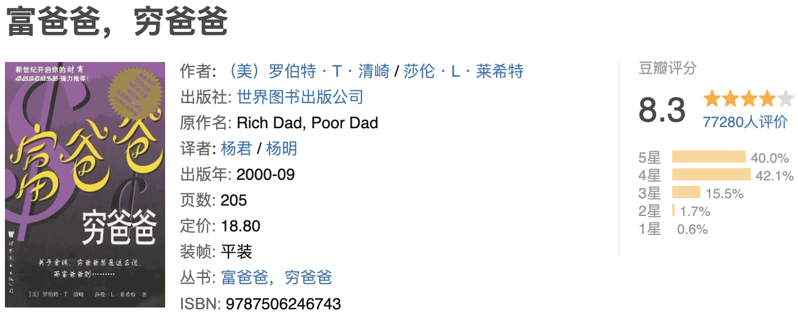

工作已三年，总是在忙碌中度过，马年年后难得清闲了几天接触到了这本《富爸爸，穷爸爸》，读完这本书让我体会到了一种相见恨晚的感觉。
     书中的很多例子是作者小时候的经历，背景差不多是上世纪五十年代的美国，他的穷爸爸所秉持的教育观和当今中国绝大多数父母的教育观几乎一致，都会对他们的孩子说“好好读书，上个好大学，学个好专业，这样才能挣到钱”，我相信这样的教育观影响了我们绝大多数的人，并且我们绝大多数人从小根本没有所谓财商教育，于是乎绝大多数人被社会培养成了一个个雇员，重复着自己的工作，总是忙碌着，有着固定的薪资，你为工作付出越多确实也能收获更多，但很少有实现财富自由的人。作者指出的这种教育观让我产生了强烈的共鸣，感觉书中的故事就是如今中国的写照。
     后来作者有幸遇到了富爸爸，是富爸爸的教育观颠覆了作者，也颠覆了我这个读者的思维。书中一共给我们上了六课，对于我这个之前几乎没什么财商教育的人来说收益匪浅，按书中的意思来说这本书算是我投资的一笔资产，花了点时间成本得到了从现在起受用终生的知识。没错，知识就是力量，大脑就是我们自身最大的资产。
     这本书重在传授财商教育，可我读来觉得这书让我得到的不仅仅是财商的教育，甚至还是一本优秀的成功学书籍，尤其是在“开始行动”这一章节，所说的“精神的力量”，“选择的力量”，“关系的力量”，“快速学习的力量”，“自律的力量”，“好建议的力量”，“无私的力量”，“专注的力量”，“神话的力量”，“给予的力量”这十种力量几乎就是一个人能够真正成功的几大要素！
     读完这本书着实让我虎躯一震，震醒了我那因忙碌而混沌的大脑；间接打通了我的任督二脉，让我对自己现在所作所为有了重新的思考！忙碌有时候就是逃避的借口，人之所以是人是因为人能够思考并付之于行动，但是对于我们绝大多数人而言似乎已经被繁忙的工作和重重的生活压力夺去了本该认真思考的时间和机会。而且如今的我们缺失的不仅仅是财商的教育，同时还缺失着书中所指出的十种力量。要想财富自由，要想获得成功，我觉得打破旧思维是首要的，其次就是一定要有所行动，否则读一本好书对我而言就只是吸了一口精神大麻而已。

----

摘抄🌟

  如果你为钱工作，你就把力量给力你的老板；如果让钱为你工作，你就控制了这种力量。 如果你对法律一无所知，就很容易被欺负；如果你了解法律，你就有还击的机会。 P153财商由四个方面的专门知识构成： 1.会计 会计就是财务知识或解读数字的能力。 2.投资 投资是钱生钱的科学。 3.了解市场 了解市场是供给与需求的科学。 4.法律 减税优惠和在诉讼中获得保护 

  三种收入： 1.劳动性收入 2.投资组合收入（纸资产收入，如股票和债权） 3.被动收入（一般指房产投资的收入） 实现财务自由和获得巨大财富的关键取决于一个人将劳动性收入转化成被动收入或投资组合收入的能力。