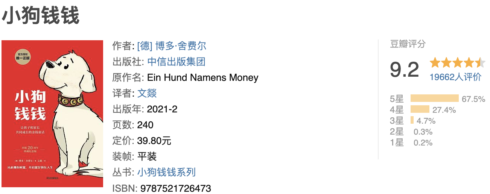

一、明确方向
这本书，让我相通了很多底层的逻辑。要想实现梦想，首先得有梦想，而且梦想越具体，越容易实现。
小狗钱钱的方法一步步，带着吉娅实现梦想的过程，你也可以直接落地去做。
首先，用本子写出10个你想变得富有的原因，也就是10个愿望。
其次，从10个愿望中，选择最想实现的3个。人往往想要的太多，能做的太少。选择3个的目的是，让你专注，聚焦。
比尔.盖茨第一次见到巴菲特时，盖茨的母亲，让他们分享自己取得成功的重要因素。盖茨和巴菲特都给出了同样的答案：“专注”。
知道自己想要什么，比知道做什么重要100倍。
“人生就像射箭，梦想就是箭靶，如果连箭和靶子都找不到的话，你每天拉弓有什么意义？”
二、紧盯方向
不忘初心，真的难。生活工作中，机会，风口太多，面对诱惑很容易偏离方向。最后做着做着，忘记自己出发的目的地。
《小狗钱钱》给出非常具体有用的方法。
第一，制作梦想相册。收集一些与自己愿望相关的照片，贴在相册里，通过图片思考。
第二，每天看几遍相册，然后想象实现后的样子。
为什么有用？讲个玄乎点的东西，人与自然宇宙之间有某种能量存在，当你想要的东西越清晰明确，宇宙就越能接受到你信息。
宇宙知道你想要的是什么，就会把你想要的东西送到你面前。
而制作梦想相册，就是把想象的东西视觉化。
第三，准备梦想储蓄罐。
为你想要实现的愿望准备一个梦想储蓄罐，在梦想储蓄罐上写上你的愿望，把照片贴在储蓄罐上。每周或者每月，有余钱就往储蓄罐里存。
这个方法，让你紧盯，聚焦在目标上。经常提醒自己，不忘初心。
紧盯为什么如此有用？因为，你的注意力在哪，你的时间在哪，就在哪里产生效果。
三、愿望实现，要有自信
自信，是实现一切梦想的基石。假如你制定的目标，时常摇摆不定，信心不足的话，那你根本不会去做。不去做，那就什么都得不到。
那怎么树立自信？写成功日记。
一个人缺乏自信，是因为自尊水平低。自尊水平低，是因为你的想法扭曲，比如变态的自我批评。想法扭曲由很多因素造成，早期，最主要是因为家庭环境。父母的批评，指责等等。（如果不够自信，推荐你看《自尊》）
而写成功日记，就是一个很好的提高自尊水平的方法。要学会自我肯定。
每天写5条你的个人成果，任何小事都行。积累自己做成功的事情，越写，就越自信。
如何才能让你有更多的成功事件写呢？做擅长的事情。
书中所说的一句话：把精力集中在你知道的、能做的和拥有的东西上。
这是我看完整本书，收获最大的一句话。因为，很多时候，我们会花很多时间去想我们不知道、不能做或没有的东西上面。
比如当看到别人做什么行业很赚钱，看到别人卖什么产品很赚钱，看到别人写文章，做短视频很赚钱。然后，想都不想，就去研究，去瞎做。
根本没想过的是，别人在自己的行业已经积累了5年，背后有很多资源支撑。别人写文章赚钱，是因为很多都是编辑出身，写文章写了10年。
不去思考背景，就把精力放进去，最后只是看着别人赚钱。然后，你又去找赚钱的项目。
当把时间和精力聚焦到你知道的、能做的和拥有的东西上，这是你的优势。做自己有优势的，擅长的事情，成功的概率自然高。

----

摘抄🌟

72小时原则。当你决定做一件事情的时候，你必须在72小时内完成，否则你很可能永远不会再做了。
2. 始终用同样的方法做同样的事情，却期待着不一样的结果，就是荒谬。
3. 勇敢的人也会害怕，一个人虽然害怕却仍然敢于前进，这才叫勇敢。
4. 不说“尝试一下”，你这有两个选择——干或者不干。干就干好。