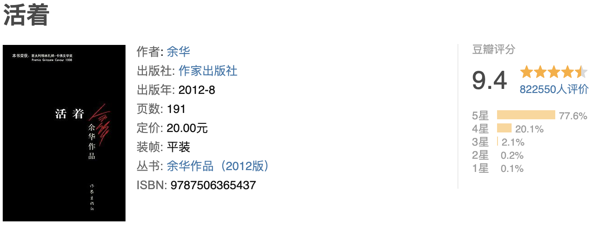

世人慌慌张张，不过图碎银几两，偏偏这碎银几两，能解世间万种慌张。
世人慌慌张张，不过是图碎银几两，偏偏这碎银几两，能解世间惆怅，让少年染上沧桑。
文字很质朴 就是太疼了 三小时看完 内心一直觉得"有必要这么惨吗" 平静下来想 确实可能这么惨 还好改革开放了 感谢邓小平 / 人死像熟透的梨 离树而落 梨者 离也

----

摘抄🌟
1、做人还是平常点好，争这个争那个，争来争去赔了自己的命。像我这样，说起来是越混越没出息，可寿命长，我认识的人一个挨着一个死去，我还活着。 
2、生活是一个人对自己经历的感受，而幸存往往是旁观者对别人经历的看法。
3、一个人命再大，要是自己想死，那就怎么也活不了。 
4、他喜欢回想过去，喜欢讲述自己，似乎这样一来，他就可以一次一次的重度此生了。 5、死亡不是失去了生命，只是走出了时间。 
6、内心让他真实地了解自己，一旦了解了自己也就了解了世界。
7、人的友爱和同情往往只是作为情绪来到，而相反的事实则是伸手便可触及。
8、人是为活着本身而活着，而不是为了活着之外的任何事物所活着。
9、作为一个词语，"活着"在我们中国的语言里充满了力量，它的力量不是来自于喊叫，也不是来自于进攻，而是忍受，去忍受生命赋予我们的责任，去忍受现实给予我们的幸福和苦难、无聊和平庸。
10、这里所说的高尚不是那种单纯的美好，而是对一切事物理解之后的超然，对善与恶一视同仁，用同情的目光看待世界。 
11、活着是自己去感受活着的幸福和辛苦，无聊和平庸；幸存，不过是旁人的评价罢了。 
12、我知道他不会和我拼命了，可他说的话就像是一把钝刀子在割我的脖子，脑袋掉不下来，倒是疼得死去活来。
13、做人不能忘记四条，话不要说错，床不要睡错，门槛不要踏错，口袋不要摸错。
14、人啊，活着时受了再多的苦，到了快死的时候也会想个法子来宽慰自己。
