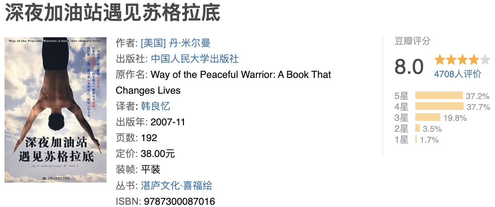
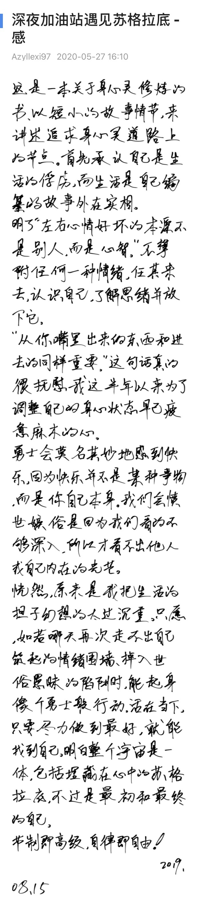

摘抄

-  “你最好为你现在这样的生活负责，而不是为你所受到的困境去责怪别人或环境。等你睁开眼时，你会看到你的健康，幸福和你生活中的各种困境。大部分都是你自己一手造成的，不管是有意还是无意。”
-   “当你完全为你的生活负起责任时，便可以成为一个完整的人。你一旦变成一个完整的人，就会发现成为勇士是什么意思。”
-   “人很多时候太多的先入为主，太多的自以为是，大脑的容量就那么大，以至于后来的很多都装不下了。”
-   “勇士采取行动，而傻瓜却只做反应。”
-   “我们生活中遇到的困境大部分是自己造成的，所以要改变困境，我们就应该改变自己。”
-   “左右心情好坏的本源不是别人，而是心智。”
-   “宁可尽全力而犯错，也不要瞻前顾后、小心翼翼地避免犯错。责任意味着同时领悟到欢乐和代价、行动和后果，然后做出选择。”
-   “吃的乐趣并不只在于食物的滋味和肚皮饱足的感觉而已，学学享受整体的过程一一之前的饥饿， 细心的调理，把餐桌布置漂亮， 咀嚼，深呼吸，嗅嗅味道: 品尝滋味，咽下，用餐后那种轻盈却洋溢着 能量的感觉，以及在食物消化了以后，你甚至能享受到轻易便将食物充分排除的过程。一旦你全神贯注于过程当中的每一个元素，就会开始欣赏简单的饮食。
-   “快乐即是加满油的油箱”

