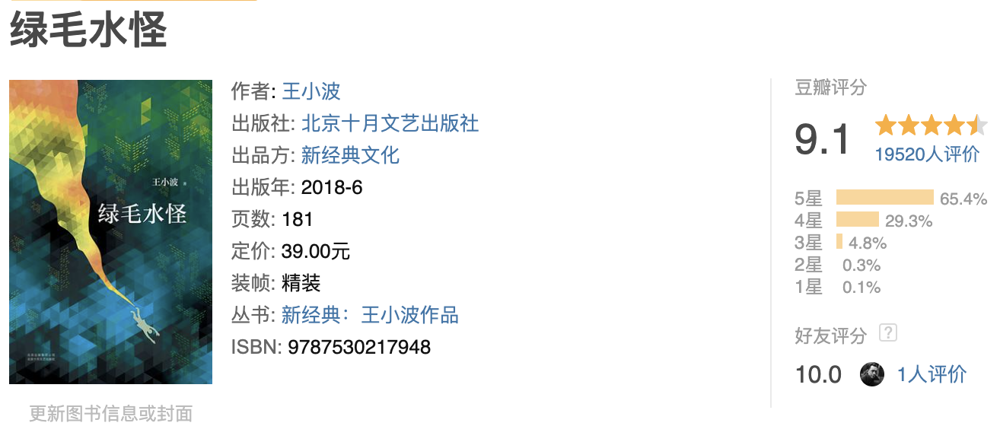

《绿毛水怪》是我和他一次对话，却也没想到和李银河不谋而合，是最喜欢的作品。在看过现实虚拟那么多人负我，我负人的故事后，我至今都觉得陈辉和妖妖的故事才是爱情。两个被孙主任说“复杂”的人，对书的痴迷，都是和那个年龄段孩子格格不入的事情。但越是脱离主流的人，越显得迷人。

他的文笔荒诞、幽默，不悲伤，俗称黑色幽默，我却慢慢喜欢这种笔调。因为和人生相似，谁不是苦中作乐。诙谐幽默总胜过苦大仇深。有些不着调的故事和玩笑，在有些人眼中那么可笑，却在有些人眼中如此珍贵。
杨素瑶，是一个好干净的名字，可能因为“素”这个字吧。而妖妖这个小名却出卖了她，一听便知是个不按常理出牌的闺女。这段故事写来轻巧，却拉了好长一个时间轴，几乎贯穿了整个美好的青春。记得自己小学的时候，隐约有“喜欢”这个概念，越是喜欢的人，越是争吵得厉害，生怕别人看出来，要造成假象，让老师同学看不出来。其实这也是“早恋”的一种迹象吧。

这种从小学，甚至幼儿园延伸出来的感情，最美好。你不用想他有没有房，有没有钱，性格合不合，只要两个人看对眼，一拍即合。这个时候的孩子很容易看对眼吧，没有什么过多的要求，纯凭着一种本能。
虽然最后陈辉并没有和杨素瑶一起走，王小波也没有继续写下去。但我知道，所有坚持爱情品质的人都知道结局。没准有一天，陈辉还能遇见杨素瑶，他也不用解释欺骗没欺骗。这些都是心知肚明的事情。因为只要来到海边，任何时刻，我相信陈辉都愿意变成一个海洋公民，只要妖妖愿意。

----

摘抄🌟

看见谁稍微有点与众不同，就要把他扼杀、摧残，直到和别人一样简单，否则就是复杂！

我说：“妖妖，你看那水银灯的灯光像什么？
大团的蒲公英浮在街道的河流上，
吞吐着柔软的针一样的光。”
妖妖说：“好，那么我们在人行道上走呢？”
我抬头看看路灯，它把昏黄的灯光隔着蒙蒙的雾气一直投向地面。
我说：“我们好像在池塘的水底。从一个月亮走向另一个月亮。”
